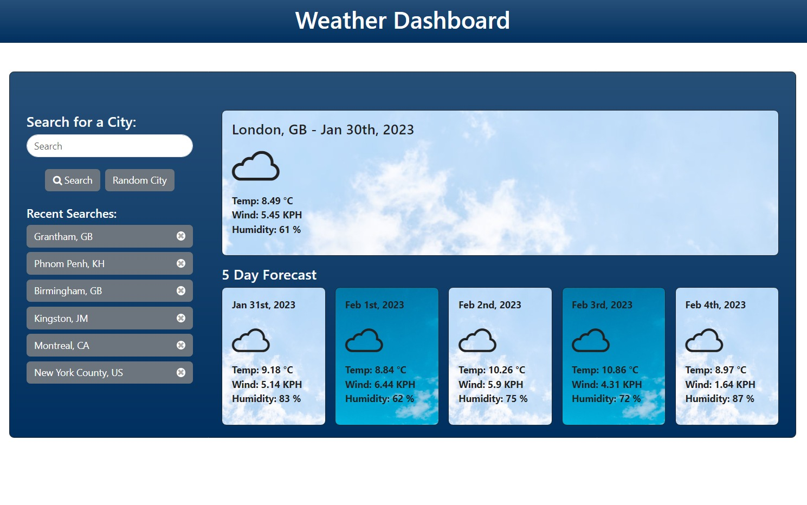

# About The Project

## A Weather Dashboard App

## Description

App Link: [(Open Weather Dashboard App)](https://misterouija.github.io/Weather-Dashboard/)

A weather dashboard app that allows the users to see the weather forecast for cities of their choosing.

(<a href="#readme-top">back to top</a>)

## Usage

Search for a city to see a 5 day weather forecast

(<a href="#readme-top">back to top</a>)

## Built With

(<a href="#readme-top">back to top</a>)

## Installation

N/A

## Credits

N/A

## License

Please refer to the LICENSE in the repo.

(<a href="#readme-top">back to top</a>)
